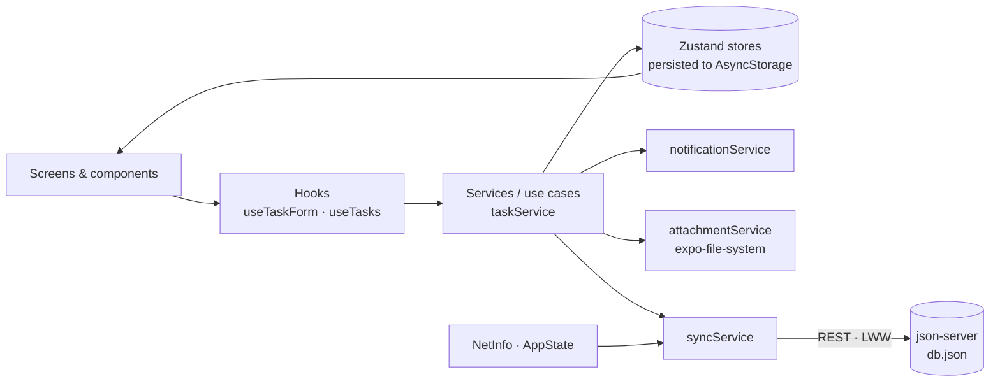

# TaskFlow — Offline-first Task Manager (React Native · Expo)

> ## 🪪 Candidate Code: **AA-RN-9722**
>
> Technical task for **SalesAutomators** — *Mobile React Native Intern* position.
> The candidate code is also shown in the app: **Settings → About** (top card), the footer of the task list, task details and Settings, and the loading screen.

TaskFlow is a production-style, offline-first task manager built with **Expo SDK 57, React Native 0.86, TypeScript (strict)** and **Zustand**. Tasks carry a due date, a location (address plus optional coordinates), image/PDF attachments and a status workflow. Every change is persisted locally, logged to an activity history, reminded via local notifications and synchronised with a **json-server** mock backend using **Last-Write-Wins** conflict resolution.

---

## Table of contents

1. [Features](#features)
2. [Tech stack](#tech-stack)
3. [Why these choices](#why-these-choices)
4. [Getting started](#getting-started)
5. [Demo walkthrough (for the video)](#demo-walkthrough-for-the-video)
6. [Building the APK](#building-the-apk)
7. [Architecture](#architecture)
8. [Quality: type-checking, linting, tests](#quality-type-checking-linting-tests)
9. [Known limitations & trade-offs](#known-limitations--trade-offs)
10. [AI / tooling disclosure](#ai--tooling-disclosure)

---

## Features

| # | Requirement | Implementation |
|---|---|---|
| 1 | **Task creation & editing** | Title, description, due date & time, location address (+ optional lat/lng), attachments, status (New / In Progress / Completed / Cancelled). Strict validation with inline error messages; saving is blocked until the form is valid. The due date must be in the future, and tasks due in **less than 30 minutes** show a warning that the 30-minute reminder falls back to the due time. Quick presets (*In 31 min*, *In 2 hours*, *Tomorrow 09:00*, *Next week*). An unsaved-changes guard prevents losing edits. |
| 2 | **List, sorting & details** | Cards show title, due date (relative, overdue in red), status chip, location summary, sync badge and attachment count. Sort by **Date Added / Due Date / Status** (asc/desc, persisted), search, status filter and due-date filter (*Overdue / Due today / Next 7 days*). The details screen has the full description, mini map, attachment viewer, status actions, status history timeline, recent activity and metadata. Delete from details or by long-pressing a card. Polished empty states. |
| 3 | **Status & history log** | Workflow transitions (New → In Progress → Completed / Cancelled, plus *reopen* / *restore*). Each task keeps its own `statusHistory`. A global persisted **History Log** records `created`, `updated`, `status_changed`, `attachment_changed`, `deleted` and `synced` entries (`timestamp`, `action_type`, `description`), grouped by day and filterable by action type. |
| 4 | **Attachments** | Photo library (multi-select), camera and document picker (PDF/images). Files are **copied into the app's private document directory**, so they survive restarts and cache clearing. Only a relative file name is stored and resolved at runtime, which survives sandbox path changes. Thumbnails and a full-screen viewer; PDFs open via the system "Open with…" sheet. Missing files show *Missing file*; undecodable images show *Corrupted*. Orphaned files from discarded forms are cleaned up. |
| 5 | **Notifications & demo mode** | A local notification is scheduled **30 minutes before the due time** (or at the due time if that is less than 30 minutes away). It is rescheduled when the due date or status changes and cancelled when the task is completed, cancelled or deleted. **“Trigger Test Notification (30s)”** is available in **Settings** and on every **task details** screen. Tapping a notification opens the task, including on cold start. Permissions are requested lazily and handled gracefully, with an "Open settings" shortcut when blocked. |
| 6 | **Map & location** | Manual address, **pick on an interactive map** (tap to place the pin), *My location*, or *From address* (geocoding), plus manual lat/lng fields. The **Map tab** shows a colour-coded pin per task with a legend and *fit all*. Tapping a pin selects the task (bottom card); tapping the callout or *Open details* navigates to it. There is also an *Open in maps app* action. |
| 7 | **Offline & sync** | Full CRUD offline. Per-task sync state **Pending Sync / Synced / Sync Failed**. NetInfo connectivity detection with an offline banner. Automatic sync after each change (debounced), on reconnect, on app foreground and on pull-to-refresh or *Sync now*. **Last-Write-Wins** conflict resolution with delete tombstones. The server URL is auto-detected and configurable in Settings. |
| 8 | **Architecture & quality** | `src/{screens,components,hooks,services,store,types,utils,theme,navigation}`. UI is separated from logic through hooks and services. Strict TypeScript models, Light/Dark/System theme available everywhere (sun/moon toggle in every header). ESLint (Expo + React Compiler rules) and a 49-test Jest suite. |

---

## Tech stack

| Concern | Choice |
|---|---|
| Framework | Expo SDK 57 · React Native 0.86 (New Architecture) · React 19.2 · TypeScript 6 (`strict`) |
| State | Zustand 5 (+ `persist` middleware) |
| Persistence | `@react-native-async-storage/async-storage` (tasks, history, settings, sync meta); `expo-file-system` (attachment files) |
| UI | React Native Paper 5 (Material 3) with custom light & dark themes; React Navigation 7 (bottom tabs + native stack) |
| Maps / location | `react-native-maps` (Expo Go, iOS, Android with a Google key); `@maplibre/maplibre-react-native` with free [OpenFreeMap](https://openfreemap.org) tiles (Android builds without a key); `expo-location` |
| Notifications | `expo-notifications` |
| Attachments | `expo-image-picker`, `expo-document-picker`, `expo-sharing` |
| Network | `@react-native-community/netinfo`, `fetch` with timeouts |
| Mock backend | `json-server` 0.17.4 (stable line) with `db.json` and a launcher script |
| Tooling | ESLint 9 (`eslint-config-expo`), Jest (`jest-expo`), EAS Build |

---

## Why these choices

- **Expo (managed workflow + EAS Build).** The fastest route to an installable APK without maintaining native projects. Config plugins cover maps, notifications, pickers and permissions, and Expo Go runs the app on a phone in seconds during development.
- **Zustand for state.** Small API, no providers or boilerplate, and, decisively, stores can be read and written outside React via `getState()`. The sync engine, notification handlers and task use-cases are plain TypeScript services, so they need exactly that. The `persist` middleware adds local persistence with one option.
- **React Native Paper (Material 3) for UI.** A complete component set with built-in light/dark theming, adequate touch targets and accessibility props, so the time went into features rather than hand-built buttons and dialogs. NativeWind was the alternative, but it provides styling, not components.
- **AsyncStorage for local data.** Works in Expo Go with no native setup, and the data set (tasks plus a capped log) is small. All persistence goes through `services/storage.ts`, so switching to MMKV or SQLite is a one-file change.
- **expo-file-system for attachments.** Picked files are copied into the app's document directory, because picker and cache URIs can be cleared by the OS.
- **React Navigation (bottom tabs + native stack).** Typed route params and explicit screen components that map one-to-one to the `screens/` folder.
- **react-native-maps.** Suggested by the assignment; works in Expo Go and uses Apple Maps on iOS.
- **MapLibre + OpenFreeMap for keyless Android builds.** Google Maps on Android needs an API key, and Google only issues one after a billing account with a payment card is set up, which wasn't available for this project. Android builds without a key therefore render with MapLibre and OpenFreeMap tiles, which need no key or account. Both renderers sit behind one `MapCanvas` component, so screens don't know which one is in use.
- **json-server 0.17.4.** The stable line (1.x is still beta and changes route semantics). Full REST with `PUT`/`DELETE`, and `--watch` lets you hand-edit `db.json` to demonstrate conflicts.
- **Last-Write-Wins sync.** Predictable and easy to reason about. Delete tombstones and in-flight edit guards cover its most common failure modes: deleted tasks coming back, and edits lost during a sync.

---

## Getting started

### Prerequisites

- **Node.js 20+** (developed with Node 22) and npm
- One of: **Expo Go** (SDK 57) on an Android/iOS phone, an **Android emulator**, or an **iOS simulator** (macOS)
- Phone and computer on the **same Wi-Fi network** when using a physical device

### 1. Install

```bash
npm install
cp .env.example .env    # optional: only needed for native builds (Google Maps key, default server URL)
```

`.env` is git-ignored, so keys never end up in the repository. Expo Go needs no `.env` at all.

### 2. Start the mock sync server (json-server)

```bash
npm run server          # json-server on 0.0.0.0:3000, watching db.json
npm run server:reset    # restore db.json from scripts/db.seed.json, then start
```

`scripts/server.js` creates `db.json` from the seed if it is missing, validates it and prints the URLs to use:

```
 Local / iOS simulator : http://localhost:3000/tasks
 Android emulator      : http://10.0.2.2:3000/tasks
 Physical device (LAN) : http://192.168.x.x:3000/tasks
```

The equivalent raw command is `npx json-server --watch db.json --host 0.0.0.0 --port 3000`. `db.json` ships with three sample tasks, which appear in the app after the first sync to show the *pull* path.

### 3. Start the app

```bash
npm start               # then press "a" (Android), "i" (iOS) or scan the QR code with Expo Go
```

Expo Go is enough for everything in the demo. To compile the native app instead (required for
a Google Maps key, and the closest thing to the shipped APK):

```bash
npm run android         # npx expo run:android - prebuilds, compiles and installs on a device/emulator
npm run ios             # npx expo run:ios - same on the iOS simulator (macOS)
```

`expo run:*` generates the `android/` (or `ios/`) folder on first use. Those folders are generated
output and stay git-ignored; `npx expo prebuild --clean` regenerates them from `app.config.ts`.

### 4. Connecting the app to the server

The app picks a sensible default automatically. You can override it in **Settings → Sync & server**, where *Test connection* reports the latency.

| Where the app runs | Server URL used by default |
|---|---|
| Physical device (Expo Go) | `http://<IP of the machine running Expo>:3000`, auto-detected from the Expo dev server |
| Android emulator | `http://<LAN IP>:3000` (auto) or `http://10.0.2.2:3000` |
| iOS simulator | `http://localhost:3000` |
| Standalone APK | Value of `EXPO_PUBLIC_API_URL` at build time, or whatever you enter in Settings |

> If a physical device cannot connect, allow inbound connections on port **3000** in your computer's firewall.

### Useful scripts

| Script | Description |
|---|---|
| `npm start` | Expo dev server (Expo Go) |
| `npm run android` / `ios` | Local native build + install (`expo run:*`) |
| `npm run server` / `server:reset` | json-server mock backend (reset restores the seed data) |
| `npm run typecheck` | `tsc --noEmit` (strict) |
| `npm run lint` | ESLint with Expo's config (includes React Compiler rules) |
| `npm test` | Jest unit and integration tests |
| `npm run verify` | typecheck + lint + tests |
| `npm run build:apk` | Cloud APK via `eas build -p android --profile preview` |
| `npm run build:apk:local` | Local release APK (prebuild + `gradlew assembleRelease`) |

---

## Demo walkthrough (for the video)

1. **Start** `npm run server` and `npm start`. Open the app and point out *Candidate Code: AA-RN-9722* in Settings → About.
2. **Seed data**: on the empty Tasks screen tap **Load demo tasks** (also available in Settings). One demo task is due in **31 minutes**, so its real 30-minute reminder fires about **1 minute** later.
3. **Validation**: tap **New task** and press *Save* on the empty form. All errors appear and saving is blocked. Fill the form, use the *In 31 min* preset, pick a location on the map, attach a photo and a PDF, then save.
4. **List**: switch between *Date Added / Due Date / Status*, toggle direction, search, filter by status.
5. **Details**: change the status (*Start* → *Complete*), open attachments, show the mini map and the status timeline.
6. **Notifications**: tap **Trigger Test Notification (30s)**, send the app to the background and wait for the notification. Tapping it opens the task.
7. **Offline**: enable airplane mode, then create or edit tasks. They show **Pending Sync** and an offline banner appears. Disable airplane mode; the app syncs automatically, the badges turn **Synced** and a `synced` entry appears in History.
8. **Last-Write-Wins conflict**: edit a task's `title` in `db.json` and set its `updatedAt` to a later timestamp. Pull to refresh in the app. The newer server version wins and History records the resolved conflict.
9. **Map**: open the Map tab, tap a pin, then open details from the bottom card (or the callout on Google/Apple maps).
10. **Theme**: tap the sun/moon icon in any header, or choose System / Light / Dark in Settings.

---

## Building the APK

### Option A - EAS Build (recommended for the submission)

```bash
npm install -g eas-cli
eas login
eas build -p android --profile preview
```

- The `preview` profile in `eas.json` produces an installable **`.apk`** (`"buildType": "apk"`, internal distribution). The first build asks to create the EAS project and generate an Android keystore; accept both.
- **Google Maps key (optional).** Without a key, the APK renders maps with MapLibre and free OpenFreeMap tiles, so no key is needed. To use Google Maps instead, create a key in Google Cloud Console with *Maps SDK for Android* enabled (ideally restricted to the package `com.aarn9722.taskflow`), and provide it at build time. Never commit it.
  - **EAS cloud build:** git-ignored `.env` files are not uploaded, so store the key as an EAS environment variable:
    ```bash
    eas env:create --environment preview --name GOOGLE_MAPS_API_KEY --value <your-key> --visibility sensitive
    ```
  - **Local native build** (`npx expo run:android`): put the key in `.env` (copied from `.env.example`).

  `app.config.ts` passes the key to the `react-native-maps` config plugin. `services/mapAvailability.ts` picks the renderer at runtime: Google Maps when the build has a key (and always in Expo Go and on iOS), MapLibre otherwise.
- **Server URL in the APK.** Enter the LAN URL in *Settings → Sync & server*, or bake in a default with `EXPO_PUBLIC_API_URL` (for example `http://192.168.1.10:3000`) as an EAS environment variable.
- Cleartext HTTP to the json-server is enabled for release builds through `expo-build-properties` (`usesCleartextTraffic`).

### Option B - local build (no EAS account)

```bash
npx expo prebuild -p android --clean     # regenerate android/ from app.config.ts
npx expo run:android --variant release   # build + install on a connected device
# or, without a device attached:
cd android && ./gradlew assembleRelease
# APK: android/app/build/outputs/apk/release/app-release.apk
```

Requires a local Android SDK and JDK 17. The release variant is signed with the template's
**debug keystore**, which is fine for side-loading and demos but not for Play Store submission.
`GOOGLE_MAPS_API_KEY` must be exported (or present in `.env`) *before* `prebuild`, because the
key is written into the generated manifest; without it the APK uses the MapLibre/OpenFreeMap map.

---

## Architecture

```
src/
├── App.tsx                 # Providers (SafeArea, Paper theme, Navigation), hydration gate, app services
├── navigation/             # Root stack + bottom tabs, typed params, navigation ref for deep links
├── screens/                # TaskList, TaskDetails, TaskForm, Map, History, Settings  (UI only)
├── components/             # Reusable presentational components (TaskCard, DateTimeField, AttachmentTile, …)
│   └── map/                #   MapCanvas: one map API over react-native-maps and MapLibre
├── hooks/                  # UI ↔ logic glue: useTaskForm, useTasks, useBackgroundSync, useNotificationSetup, …
├── services/               # Side effects & use cases
│   ├── taskService.ts      #   create / update / changeStatus / delete (history + reminders + sync in one place)
│   ├── syncService.ts      #   sync engine (triggers, LWW, tombstones, failure handling)
│   ├── apiClient.ts        #   REST client for json-server with timeouts & typed errors
│   ├── notificationService.ts
│   ├── attachmentService.ts
│   ├── locationService.ts
│   ├── serverConfig.ts     #   server URL auto-detection / override
│   ├── mapAvailability.ts  #   picks the map renderer (react-native-maps, or MapLibre in Android builds without a key)
│   ├── storage.ts          #   AsyncStorage adapter for Zustand persist (single swap point for MMKV)
│   └── demoData.ts
├── store/                  # Zustand stores: tasks, history, settings, sync, ui (snackbar)
├── types/                  # Task, Attachment, HistoryLog, SyncStatus, …
├── theme/                  # MD3 light/dark themes, semantic status colours, dark map style
└── utils/                  # Pure logic: validation, LWW decisions, sorting, reminders, dates (unit-tested)
```



### State management (Zustand)

| Store | Persisted | Purpose |
|---|---|---|
| `taskStore` | ✅ | Tasks (including local-only fields and delete tombstones) and atomic sync bookkeeping actions |
| `historyStore` | ✅ | Activity log, newest first, capped at 500 entries |
| `settingsStore` | ✅ | Theme preference, server URL override, auto-sync, sort preference |
| `syncStore` | partly | Online state and `isSyncing` (runtime); last sync time, error and summary (persisted) |
| `uiStore` | ❌ | Global snackbar messages (`notify()` usable from anywhere) |

Components select narrow slices. Derived lists (filtering, sorting) are memoised in hooks so selectors stay referentially stable, as Zustand v5 requires. Screens never orchestrate side effects: every mutation goes through `taskService`, which updates the store, writes the history log, (re)schedules the reminder and requests a sync.

### Storage

- **Structured data**: Zustand `persist` + `createJSONStorage(AsyncStorage)`, one key per store, versioned for future migrations. The UI waits for rehydration of all stores (`useHydration`) before rendering, so it never flashes empty data.
- **Attachments**: copied to `<documents>/attachments/<uuid>.<ext>`. Metadata (name, MIME type, kind, size, date) lives on the task. The absolute URI is computed at runtime from the stored relative file name, because the app container path can change between launches or updates (notably on iOS).

### Sync engine (`syncService`)

**Triggers**
- Every local mutation (debounced by 1.5 s)
- Connectivity regained (NetInfo)
- App returning to the foreground
- App start
- Pull-to-refresh or *Sync now*

Concurrent requests share the in-flight run and queue exactly one follow-up run.

**Algorithm** (per task id, over the union of local and remote ids)
1. `GET /tasks` and validate every record defensively (malformed records are skipped).
2. Decide an action with the **pure** `decideSyncAction()` in `utils/sync.ts`. `updatedAt` is the logical clock.

| Local state | Remote | Action |
|---|---|---|
| Pending / Failed | missing | `POST` (create) |
| Pending / Failed | older | `PUT` (local wins) |
| Pending / Failed | **newer** | pull: **server wins** (conflict logged) |
| Synced | newer | pull |
| Synced | same | no-op |
| Synced | missing | re-upload (server lost the record) |
| Deleted (tombstone) | missing | purge locally |
| Deleted (tombstone) | older than deletion | `DELETE` on server, then purge |
| Deleted (tombstone) | **edited after deletion** | restore from server (LWW) |
| — | only on server | pull |

3. Apply the results with **race guards**: `markSynced` / `applyRemoteTask` only apply if the task's `updatedAt` did not change while the request was in flight, so edits made during a sync are never overwritten.
4. Reschedule reminders for pulled tasks, record the per-task **Sync Failed** state and error, and write a `synced` history entry that summarises the run (pushed / pulled / deleted / conflicts).

Local-only fields (`syncStatus`, `notificationId`, tombstone, …) are stripped before upload (`toRemoteTask`).

### Notifications (`notificationService`)

- A foreground presentation handler is configured at startup, and an Android channel `task-reminders` is created with high importance.
- `planReminder()` returns *due − 30 min*, the due time itself when less than 30 minutes are left, or nothing when the task is already due.
- The notification id is stored on the task (local-only) so the reminder can be cancelled or rescheduled on edit, status change or deletion.
- **Startup reconciliation** cancels reminders for tasks that were closed or deleted and re-creates missing future reminders.
- The notification payload carries `taskId`. Tapping a notification navigates through a navigation ref; the request is queued until navigation is ready, which covers cold starts.
- Demo: *Trigger Test Notification (30s)* schedules a `TIME_INTERVAL` notification 30 seconds ahead.

### Validation

All rules live in `utils/validation.ts` as pure, unit-tested functions:
- title 3–100 characters, description 5–2000, address 3–200
- due date required and in the future; an existing task may keep its unchanged past date so overdue tasks can still be closed
- coordinates optional, but must be a complete, in-range pair
- at most 10 attachments of 25 MB each

Errors appear after a field is touched or when saving is attempted, and invalid submissions are blocked.

### Theming

Material 3 light and dark themes with semantic status, sync and history colours. The preference (*System / Light / Dark*) is persisted and toggled from any screen header. The navigation theme, status bar and a dark Google Maps style follow the active theme.

---

## Quality: type-checking, linting, tests

```bash
npm run verify     # tsc --noEmit && expo lint && jest
```

- **TypeScript strict**, with no `any` in application code.
- **ESLint** (`eslint-config-expo`, including the React Compiler rules: render purity, no setState in effects, no ref access during render).
- **49 Jest tests**:
  - `validation.test.ts`: every form rule, coordinate parsing and server URL helpers
  - `sync.test.ts`: the full Last-Write-Wins decision table, tombstones, payload mapping and defensive parsing
  - `sort.test.ts`: sorting, search, status and due-date range filters
  - `attachments.test.ts`: attachment diffing used for the history log
  - `reminder.test.ts`: reminder timing and history grouping
  - `syncService.test.ts`: an integration test of the real sync engine and stores against an in-memory json-server double (push, pull, conflicts in both directions, deletions, unreachable server, offline)
- The Android JS bundle builds cleanly (`npx expo export --platform android`), and `npx expo-doctor` passes.

---

## Known limitations & trade-offs

- **Clock-based Last-Write-Wins.** Conflicts are resolved per task using client `updatedAt` timestamps. Device clock skew can pick the "wrong" winner, and merges are whole-record, not field-level. A production backend would issue server timestamps or versions (or use CRDTs).
- **Deletions made by other clients are not propagated.** If a synced task disappears from the server, the device re-uploads it (the device is treated as the source of truth, which protects against a reset `db.json`). Local deletions do propagate, via tombstones.
- **Attachment binaries are not uploaded.** Only metadata is synced (json-server has no file storage). Tasks pulled on another device show a graceful *Missing file* placeholder.
- **Mock backend.** json-server has no authentication or server-side validation, and uses plain HTTP. Cleartext traffic (Android) and ATS arbitrary loads (iOS) are enabled only to reach it and would be removed in production.
- **Notifications are local only** (no push server). Android may defer exact timing under battery optimisation (`SCHEDULE_EXACT_ALARM` is declared), and iOS keeps at most 64 pending notifications. In Expo Go on Android, *remote* push is unavailable since SDK 53, but local notifications (everything used here) work.
- **Maps.** No Google Cloud billing account (it requires a payment card) was available for this project, so the Android APK is built without a Google Maps key and renders maps with MapLibre and the free, public OpenFreeMap tile service, which has no SLA. In that renderer pins are placed by tapping (they can't be dragged) and there are no native callouts; the bottom task card covers both. Expo Go and iOS keep react-native-maps. Map tiles need a network connection. Geocoding uses the platform geocoder, requires location permission and network, and may return no result.
- **PDF preview.** PDFs open in the system viewer via the share sheet rather than rendering inline. This keeps the app Expo Go-compatible without an extra native PDF module.
- **AsyncStorage over MMKV.** Chosen for Expo Go compatibility. Each store is serialised as one JSON document, which is fine for hundreds of tasks. For large datasets, swap in MMKV or SQLite behind `services/storage.ts`.
- **Scope.** Single user, no pagination; the history log keeps the latest 500 entries. Web is not a target platform.

---

## AI / tooling disclosure

This project was developed with **Claude Code** (Anthropic's agentic coding assistant) acting as an AI pair-programmer. Claude Code was used to scaffold the Expo project, implement features, write the unit and integration tests, and draft this README.

All generated code was checked with the strict TypeScript compiler, ESLint (including the React Compiler rules) and the Jest suite. It was bundled for Android and exercised against a running json-server instance.

Responsibility for the submission, including understanding, running and explaining the code, remains with the candidate. Other tools: Expo CLI, EAS Build, npm, json-server.

---

<p align="center"><b>Candidate Code: AA-RN-9722</b> · TaskFlow · SalesAutomators Mobile React Native Intern test task</p>
